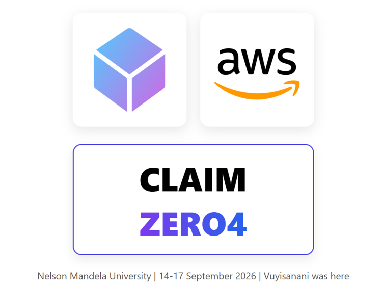

# CLAIM ZERO

A containerized React application deployed to AWS with Amazon ECR, Terraform, Amazon ECS on EC2, and a GitHub-based CI/CD pipeline using AWS CodePipeline and CodeBuild.

## Overview

The project follows the application through three stages:

1. **Build** — Develop and containerize the React application with Docker.
2. **Publish & Provision** — Push the Docker image to Amazon ECR and provision the AWS infrastructure with Terraform.
3. **Automate** — Connect GitHub to AWS CodePipeline to automatically build and deploy changes to ECS.

The final result is a React application running in a Docker container on an Amazon ECS cluster backed by an EC2 instance, with deployments automated through a CI/CD pipeline.

